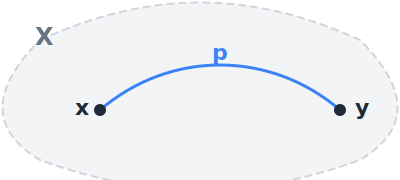
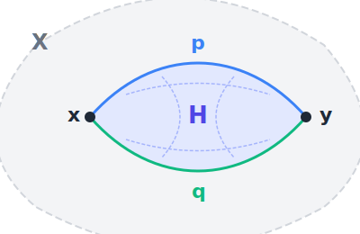

# 1. Homotópia típuselmélet és Cubical Agda

## Motiváció

**Probléma:** A típusok lakóinak egyenlősége.

**Coq-ban:** 

~~~ coq
Require Import Setoid.
Require Import Morphisms.

Inductive AddPA : Type :=
  | Zero : AddPA
  | Succ : AddPA -> AddPA
  | Add  : AddPA -> AddPA -> AddPA.

Reserved Notation "x ≡ y" (at level 70).

Inductive AddPAEquiv : AddPA -> AddPA -> Prop :=
  (* Ekvivalenciareláció: *) 
  | Cong_refl  : forall x, x ≡ x
  | Cong_sym   : forall x y, x ≡ y -> y ≡ x
  | Cong_trans : forall x y z, x ≡ y -> y ≡ z -> x ≡ z
  
  (* Kongruencia szabályok: *)
  | Cong_Succ : forall x y, x ≡ y -> Succ x ≡ Succ y
  | Cong_Add  : forall x1 x2 y1 y2, x1 ≡ x2 -> y1 ≡ y2 -> Add x1 y1 ≡ Add x2 y2
  
  (* Algebrai egyenletek: *)
  | Eq_Add_Zero : forall x, Add Zero x ≡ x
  | Eq_Add_Succ : forall x y, Add (Succ x) y ≡ Succ (Add x y)
where "x ≡ y" := (AddPAEquiv x y).
~~~

A Coq-ban (= Martin-Löf típuselmélet + induktív típusok + pattern matching) az adat puszta forma: ami máshogy épül fel, az definíció szerint nem lehet egyenlő. Az egyenlőség ekvivalenciarelációként definiálható (setoid): az algebrai egyenlőségeket külső kongruenciákként adjuk meg és így számolunk vele tovább. Ezt a rendkívül körülményes kongruencia módszert nevezzük **Setoid Hell**-nek.

**Cubical Agdában:** 

~~~ agda

{-# OPTIONS --cubical #-}

module AddPA where

open import Cubical.Foundations.Prelude

data AddPA : Type where
  -- A szabad algebra:
  zero : AddPA
  succ : AddPA → AddPA
  add  : AddPA → AddPA → AddPA

  -- Algebrai egyenletek: 
  eq-add-zero : (x : AddPA) → add zero x ≡ x                    -- (út-konstruktorok) (≡ eleve ekrel és kongruencia)
  eq-add-succ : (x y : AddPA) → add (succ x) y ≡ succ (add x y)

  -- "Halmazzá" csonkolás:
  trunc : isSet AddPA -- kilapítjuk az egyenlőség típust (UIP)
~~~ 

A klasszikus típuselméletben (MLTT, Coq) egy induktív típus kizárólag "pontszerű" konstruktorokból állhat. Ilyenek a Zero és a Succ. Amikor definiálsz egy típust, lényegében csak bedobálsz diszkrét építőkockákat egy vödörbe. Ezek az építőkockák sosem érnek össze, közöttük nincs semmilyen folytonos átmenet vagy beépített reláció.

A Higher Inductive Types (HIT-ek) eltüntetik ezt a korlátot: a típus definíciójában nem csak "pontokat" adunk meg, hanem út-konstruktorokat (egyenlőségek konstruktorokat) is. Itt a típusok "topologikus terek": a típus megalkotásakor bizonyos pontokat összeragasztunk folytonos utakkal. A homotópia típuselméletben (HoTT) az egyenlőség is egy folytonos út, így magát a matematikai egyenlőséget is bele kódoljuk a típusba.

---

## Geometriai intuíció – mi az a homotópia?

A típuselméletben az egyenlőségekre geometriai objektumokként tekintünk. Mielőtt kódot írnánk, ismételjük át a fogalmakat a klasszikus topológia nyelvén, mert a Cubical Agda pontosan ezt a geometriát implementálja!

* **Terek és pontok:** Adott egy $X$ topologikus tér (ez felel meg a típusnak) és benne pontok, például $x, y \in X$ (ezek a lakók).
* **Utak (paths):** Az egyenlőség ($x = y$) típus lakója itt egy folytonos út $x$-ből $y$-ba. Topológiailag ez egy folytonos $p : [0,1] \to X$ függvény, ahol a kezdőpont $p(0) = x$, a végpont pedig $p(1) = y$.

  

* **Homotópia (utak közötti egyenlőség):** Ha két különböző bizonyításunk (út) is van $x$ és $y$ között, mondjuk $p$ és $q$, a két bizonyítás pontosan akkor "egyenlő", ha létezik közöttük egy **homotópia**.

  **Definíció:** $H : [0,1] \times [0,1] \to X$ *homotópia, $p$ és $q$ között,* ha $H$ folytonos (a szuprémum normában), kezdő és végállapota rendre $p$ és $q$:

  $$H(., 0) = p\text{ és }H(., 1) = q$$

  és a végpontokat végig rögzítve hagyja:

  $$H(0, .) = x \text{ és }H(1, .) = y.$$

  Geometriailag ez a folytonos deformáció egy 2-dimenziós felület, ami folytonosan bekoordinátázva "kitölti" a két út közötti teret.

  

    
  

**Miért jó ez nekünk?**
A klasszikus matematikában (és a hagyományos típuselméletben), ha két dolog egyenlő, az egy puszta tény. Vagyis az egyenlőségnek egyetlen konstruktora van: $refl$. A HoTT-ban az egyenlőség egy strukturált adat: egy út. Két dolog többféleképpen is egyenlő lehet (több különböző út vezethet $x$-ből $y$-ba), és maguk a lakók (utak) között is definiálható egyenlőség (homotópia), majd a homotópiák között magasabb dimenziós homotópiák, és így tovább.

A HoTT geometriai modellje teszi lehetővé, hogy az egyenlőség olyan tulajdonságait, mint a szimmetria (az út bejárása visszafelé, $q(t):=p(1-t)$ ) vagy a tranzitivitás (két út összefűzése), ne külső logikai axiómákként kelljen megkövetelni, hanem a tér folytonosságából adódó, beépített geometriai operációkként kapjuk meg őket.

##  Curry-Howard-Voevodsky (CHV) izomorfizmus

| Logika | Programozás | Geometria / Topológia |
| :--- | :--- | :--- |
| Állítás | Típus | Tér |
| Bizonyítás | Kifejezés | Pont |
| **Egyenlőség** | **Azonosság típusa** | **Út (Path)** |

### Érdekesség: függvény extenzionalitás

Egy programozó számára az a naiv állítás, hogy *"két függvény egyenlő, ha minden bemenetre ugyanazt a kimenetet adják"*, egy rémálom. Gondoljunk bele: a gyorsrendezés ($O(n \log n)$) és a buborékrendezés ($O(n^2)$) kimenete minden listára megegyezik. De vajon ez a két program *ugyanaz-e*?

A klasszikus típuselméletben (MLTT, Coq, sima Agda) az egyenlőség szigorú szintaktikus azonosságot jelent. Ha itt erőszakkal bevezetnénk a függvény extenzionalitást, azzal azt hazudnánk, hogy ez a két kód fizikailag azonos, ami abszurdum. Emiatt a sima Agdában a FunExt nem bizonyítható.

A homotópia típuselméletben és a Cubical Agdában az egyenlőség már nem egy merev, "igen/nem" szintaktikus azonosság, hanem egy folytonos út. Két dolog lehet *sokféleképpen* egyenlő.

A HoTT-beli függvény extenzionalitás már nem azt mondja, hogy a két algoritmus "ugyanaz a dolog". Azt mondja, hogy ha minden egyes $x$ bemenetre létezik egy $p(x) : f(x) \equiv g(x)$ út a kimenetek között, akkor ezekből kifeszíthető egy magasabb dimenziós út (homotópia) maguk a függvények között:

$$P : f \equiv g$$

### Érdekesség: ∞-grupoid Hell

A típuselméleti kutatók egy jelentős része érzi, hogy a HoTT egy végtelen dimenziós topologikus ágyúval lő egy egydimenziós verébre. Ha a mindennapi programozáshoz és klasszikus algebrához csak függvény extenzionalitást (FunExt) és hányadostereket (Quotient/HIT) akarunk, akkor a HoTT a nyakunkba zúdítja az ∞-grupoidok koherencia-rémálmát. Sokszor trunc (csonkolás) operátorokat kell használnunk, hogy a rendszer ne akarjon a hátunk mögött többdimenziós felületeket gyártani abból, ami nekünk csak egy egyszerű halmaz.

Erre a "túllövésre" válaszul születtek meg azok a nem-geometriai alternatívák, amelyek megadják a szabadságot, de a topológia nélkül:

* Observational Type Theory (OTT): Az egyenlőséget nem topologikus útként, hanem megfigyelhető viselkedésként definiálja, így a magasabb dimenziós sallangok nélkül, tisztán 1-dimenziós halmazokon belül oldja meg a függvény extenzionalitást.

* A Lean közösség pragmatizmusa: Teljesen eldobja a HoTT geometriáját, és a klasszikus, lapos típuselmélet magjába nyers, beépített axiómaként drótozza bele a FunExt-et és a hányadostereket, maximálisan kiszolgálva a dolgozó matematikusok gyakorlati igényeit.

* Extensional Type Theory (ETT): A "nukleáris opció", amely kimondja, hogy ha logikailag be tudsz bizonyítani egy egyenlőséget, a fordító azt onnantól szintaktikailag is azonosnak veszi; ez az egyenlőségkezelést triviálissá teszi, de cserébe a kód lefordulása (a típusellenőrzés) algoritmikusan eldönthetetlenné válik.
