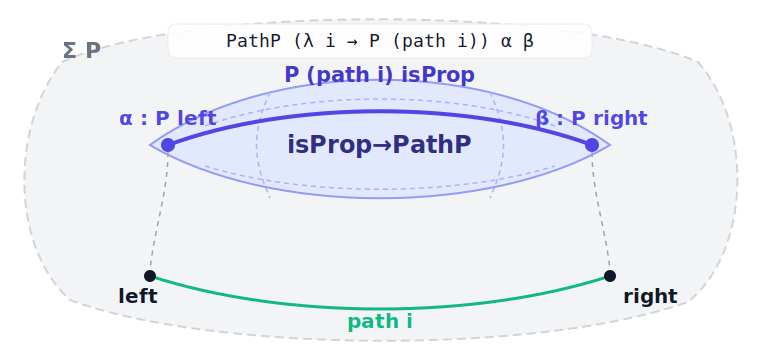
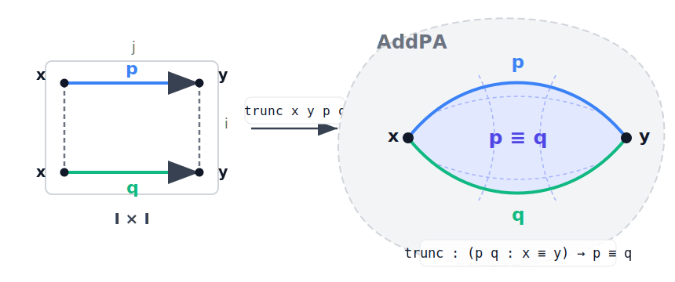
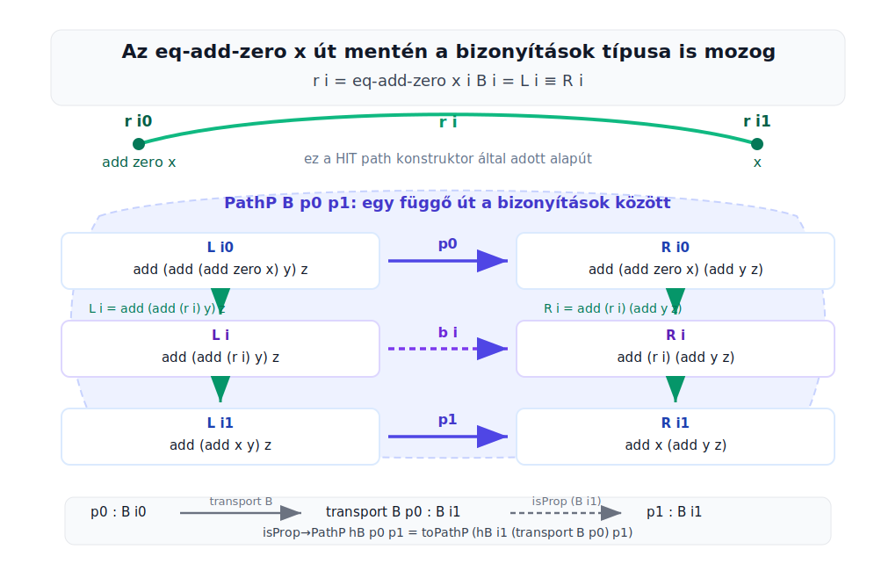

# AddPA cubical agda gyakorló

<style>
pre:has(code.language-agda) {
  background: #f0f7ff !important;
  border: 1px solid #93c5fd !important;
  border-left: 6px solid #2563eb !important;
  border-radius: 8px !important;
  padding: 12px 14px !important;
}

pre:has(code.language-text) {
  background: #fff8e6 !important;
  border: 1px solid #f3d27a !important;
  border-left: 6px solid #ca8a04 !important;
  border-radius: 8px !important;
  padding: 12px 14px !important;
}

pre:has(code.language-agda-fragment) {
  background: #f8f5ff !important;
  border: 1px solid #c4b5fd !important;
  border-left: 6px solid #7c3aed !important;
  border-radius: 8px !important;
  padding: 12px 14px !important;
}

pre:has(code.language-coq) {
  background: #f7fee7 !important;
  border: 1px solid #bef264 !important;
  border-left: 6px solid #65a30d !important;
  border-radius: 8px !important;
  padding: 12px 14px !important;
}

code.language-agda {
  display: block;
  background: #f0f7ff !important;
}

code.language-text {
  display: block;
  background: #fff8e6 !important;
}

code.language-agda-fragment {
  display: block;
  background: #f8f5ff !important;
}

code.language-coq {
  display: block;
  background: #f7fee7 !important;
}
</style>

## AddPA mint halmazcsonkolt kvóciens-induktív típus

```agda
module AddPA where

open import Cubical.Foundations.Prelude
open import Cubical.Foundations.HLevels

data AddPA : Type where
  zero : AddPA
  succ : AddPA -> AddPA
  add  : AddPA -> AddPA -> AddPA

  eq-add-zero : (x : AddPA) -> add zero x ≡ x
  eq-add-succ : (x y : AddPA) -> add (succ x) y ≡ succ (add x y)

  trunc : isSet AddPA
```

Betöltés, type-check: Ctrl + C, Ctrl + L

Kibontva az isProp-ot:

```agda-fragment
isProp : Type ℓ -> Type ℓ
isProp A = (x y : A) -> x ≡ y

isSet : Type ℓ -> Type ℓ
isSet A = (x y : A) -> isProp (x ≡ y)
```

Tehát:

```agda-fragment
trunc : (x y : AddPA) -> isProp (x ≡ y)
trunc : (x y : AddPA) -> (p q : x ≡ y) -> p ≡ q
```

## További fontos eszközök

```agda-fragment
cong f p
  : f a ≡ f b
  -- ha p : a ≡ b

sym p
  : b ≡ a
  -- ha p : a ≡ b
```

és persze, amit már eddig tudunk:

```agda-fragment
eq-add-zero x
  : add zero x ≡ x

eq-add-succ x y
  : add (succ x) y ≡ succ (add x y)
```

Egyenlőség-láncolás:

```agda-fragment
u
  ≡⟨ p ⟩
v
  ≡⟨ q ⟩
w
  ∎
```

Unicode input mode nálam "ű" :D másoknál settings, keyboard shortcuts Agda: Activate Imput Mode karakter.

## Első példák

### 0 + 1 = 1

Formálisan:

```agda-fragment
add zero (succ zero) ≡ succ zero
```

Implementáció:

```agda
proof_of_0+1=1 : add zero (succ zero) ≡ succ zero
proof_of_0+1=1 =
  add zero (succ zero)
    ≡⟨ eq-add-zero (succ zero) ⟩
  succ zero
    ∎
```

### 1 + 0 = 1

Formálisan: 

```agda-fragment
add (succ zero) zero ≡ succ zero
```

Implementáció:

```agda
proof_of_1+0=1 : add (succ zero) zero ≡ succ zero
proof_of_1+0=1 =
  add (succ zero) zero
    ≡⟨ eq-add-succ zero zero ⟩
  succ (add zero zero)
    ≡⟨ cong succ (eq-add-zero zero) ⟩
  succ zero
    ∎
```

### 1 + 1 = 2

Formálisan:

```agda-fragment
add (succ zero) (succ zero) ≡ succ (succ zero)
```

Implementáció:

```agda
proof_of_1+1=2 : add (succ zero) (succ zero) ≡ succ (succ zero)
proof_of_1+1=2 =
  add (succ zero) (succ zero)
    ≡⟨ eq-add-succ zero (succ zero) ⟩
  succ (add zero (succ zero))
    ≡⟨ cong succ (eq-add-zero (succ zero)) ⟩
  succ (succ zero)
    ∎
```


## Associativitás 

Hogyan induljunk el? Lyukat képezünk :)

```agda-fragment
assoc-add : (x y z : AddPA) -> add (add x y) z ≡ add x (add y z)
assoc-add x y z = {! x !}
```

Pattern matching case split `x`-re: (Ctrl C + Ctrl C)

```agda-fragment
assoc-add zero y z = {! !}
assoc-add (succ x) y z = {! !}
assoc-add (add x x₁) y z = {! !}
assoc-add (eq-add-zero x i) y z = {! !}
assoc-add (eq-add-succ x x₁ i) y z = {! !}
assoc-add (trunc x x₁ p q i j) y z = {! !}
```

Mi-micsoda?

```text
zero, succ, add       érték-konstruktorok
eq-add-zero, eq-add-succ  path-konstruktorok
trunc                 square/koherencia-konstruktor
```

## Path-konstruktor sablon

Legyen:

```agda-fragment
P : AddPA -> Type
f : (x : AddPA) -> P x
P-isProp : (x : AddPA) -> isProp (P x)
```

Ha:

```agda-fragment
path args : left ≡ right
```

akkor:

```agda-fragment
f (path args i) =
  isProp→PathP
    (λ i -> P-isProp (path args i))
    (f left)
    (f right)
    i
```

Használat:

```text
path-konstruktor eset = út a bizonyítások között
ha P minden pontban prop, elég a két végpont
```

<p align="center">
  
</p>

Homotópiai képletek:

$$
\gamma : I \to A,\qquad \gamma(i)=\mathsf{path}\;i
$$

$$
B_i := P(\gamma(i)),\qquad h_i : \mathsf{isProp}(B_i)
$$

$$
\alpha : B_{i0},\qquad \beta : B_{i1}
$$

$$
\mathsf{isProp{\to}PathP}\;h\;\alpha\;\beta
  : \mathsf{PathP}\;(\lambda i \to B_i)\;\alpha\;\beta
$$

Geometriai olvasat:

$$
H : I \to \coprod_{i:I} B_i,\qquad
\pi(H(i))=\gamma(i),\qquad
H(i0)=\alpha,\quad H(i1)=\beta.
$$

Az `assoc-add` esetben:

$$
a_i := \mathsf{eq{-}add{-}zero}\;x\;i
$$

$$
B_i :=
\bigl(\mathsf{add}\;(\mathsf{add}\;a_i\;y)\;z
  \equiv
  \mathsf{add}\;a_i\;(\mathsf{add}\;y\;z)\bigr)
$$

$$
H(i) : B_i.
$$

## Trunc-konstruktor sablon

Legyen:

```agda-fragment
P : AddPA -> Type
f : (x : AddPA) -> P x
P-isProp : (x : AddPA) -> isProp (P x)
```

Ekkor:

```agda-fragment
f (trunc x y p q i j) =
  isSet→SquareP
    (λ i j -> isProp→isSet (P-isProp (trunc x y p q i j)))
    (λ j -> f (p j))
    (λ j -> f (q j))
    (λ i -> f (trunc x y p q i i0))
    (λ i -> f (trunc x y p q i i1))
    i j
```

<p align="center">
  
</p>

Homotópiai képletek:

$$
p,q : x \equiv y
$$

$$
p(i0)=q(i0)=x,\qquad p(i1)=q(i1)=y
$$

$$
\mathsf{trunc}\;x\;y\;p\;q : p \equiv q
$$

Ez egy rögzített végpontú homotópia:

$$
H : I \times I \to \mathsf{AddPA}
$$

$$
H(i0,j)=p(j),\qquad H(i1,j)=q(j)
$$

$$
H(i,i0)=x,\qquad H(i,i1)=y
$$

Az eliminációs négyzetnél:

$$
K(i,j) : P(H(i,j))
$$

határfeltételekkel:

$$
K(i0,j)=f(p(j)),\qquad K(i1,j)=f(q(j))
$$

$$
K(i,i0)=f(H(i,i0)),\qquad K(i,i1)=f(H(i,i1)).
$$

Olvasat:

```text
trunc x y p q : p ≡ q
p q : x ≡ y
trunc x y p q i j : AddPA
```

## Asszociativitás

Állítás:

```agda-fragment
assoc-add : (x y z : AddPA) -> add (add x y) z ≡ add x (add y z)
```

Prop-ság:

```agda-fragment
assoc-add-isProp : (x y z : AddPA) ->
  isProp (add (add x y) z ≡ add x (add y z))
assoc-add-isProp x y z =
  trunc (add (add x y) z) (add x (add y z))
```

### Zero eset

```agda-fragment
assoc-add zero y z =
  add (add zero y) z
    ≡⟨ cong (λ t -> add t z) (eq-add-zero y) ⟩
  add y z
    ≡⟨ sym (eq-add-zero (add y z)) ⟩
  add zero (add y z)
    ∎
```


### Succ eset

```agda-fragment
assoc-add (succ x) y z =
  add (add (succ x) y) z
    ≡⟨ cong (λ t -> add t z) (eq-add-succ x y) ⟩
  add (succ (add x y)) z
    ≡⟨ eq-add-succ (add x y) z ⟩
  succ (add (add x y) z)
    ≡⟨ cong succ (assoc-add x y z) ⟩
  succ (add x (add y z))
    ≡⟨ sym (eq-add-succ x (add y z)) ⟩
  add (succ x) (add y z)
    ∎
```

Lépések:

```text
1. eq-add-succ x y a belső add-ra, cong alatt
2. eq-add-succ (add x y) z a külső add-ra
3. indukciós hipotézis: assoc-add x y z, succ alatt
4. eq-add-succ x (add y z) visszafelé
```

### Add eset

```agda-fragment
assoc-add (add x y) z w =
  add (add (add x y) z) w
    ≡⟨ cong (λ t -> add t w) (assoc-add x y z) ⟩
  add (add x (add y z)) w
    ≡⟨ assoc-add x (add y z) w ⟩
  add x (add (add y z) w)
    ≡⟨ cong (add x) (assoc-add y z w) ⟩
  add x (add y (add z w))
    ≡⟨ sym (assoc-add x y (add z w)) ⟩
  add (add x y) (add z w)
    ∎
```

Lépések:

```text
1. assoc-add x y z a bal belső részre, cong alatt
2. assoc-add x (add y z) w
3. assoc-add y z w az add x alatt
4. assoc-add x y (add z w) visszafelé
```

### `eq-add-zero` path eset

Konstruktor:

```agda-fragment
eq-add-zero x : add zero x ≡ x
```

Végek:

```agda-fragment
eq-add-zero x i0 = add zero x
eq-add-zero x i1 = x
```

Bizonyítás:

```agda-fragment
assoc-add (eq-add-zero x i) y z =
  isProp→PathP
    (λ i -> assoc-add-isProp (eq-add-zero x i) y z)
    (assoc-add (add zero x) y z)
    (assoc-add x y z)
    i
```

A helyzet képe:

<p align="center">
  
</p>

Behelyettesítés az `isProp→PathP` ábrába:

```text
path = eq-add-zero x
left = add zero x
right = x
P a = add (add a y) z ≡ add a (add y z)
α = assoc-add (add zero x) y z
β = assoc-add x y z
```

### `eq-add-succ` path eset

Konstruktor:

```agda-fragment
eq-add-succ x y : add (succ x) y ≡ succ (add x y)
```

Bizonyítás:

```agda-fragment
assoc-add (eq-add-succ x y i) z w =
  isProp→PathP
    (λ i -> assoc-add-isProp (eq-add-succ x y i) z w)
    (assoc-add (add (succ x) y) z w)
    (assoc-add (succ (add x y)) z w)
    i
```

Behelyettesítés az `isProp→PathP` ábrába:

```text
path = eq-add-succ x y
left = add (succ x) y
right = succ (add x y)
P a = add (add a z) w ≡ add a (add z w)
α = assoc-add (add (succ x) y) z w
β = assoc-add (succ (add x y)) z w
```

### `trunc` eset

Bizonyítás:

```agda-fragment
assoc-add (trunc x y p q i j) z w =
  isSet→SquareP
    (λ i j -> isProp→isSet (assoc-add-isProp (trunc x y p q i j) z w))
    (λ j -> assoc-add (p j) z w)
    (λ j -> assoc-add (q j) z w)
    (λ i -> assoc-add (trunc x y p q i i0) z w)
    (λ i -> assoc-add (trunc x y p q i i1) z w)
    i j
```

Behelyettesítés a `trunc` ábrába:

```text
P a = add (add a z) w ≡ add a (add z w)
f a = assoc-add a z w

felső oldal = λ j -> f (p j)
alsó oldal  = λ j -> f (q j)
bal oldal   = λ i -> f (trunc x y p q i i0)
jobb oldal  = λ i -> f (trunc x y p q i i1)
```

## Teljes futtatható `assoc-add` blokk

```agda
assoc-add-isProp : (x y z : AddPA) ->
  isProp (add (add x y) z ≡ add x (add y z))
assoc-add-isProp x y z =
  trunc (add (add x y) z) (add x (add y z))

{-# TERMINATING #-}
assoc-add : (x y z : AddPA) -> add (add x y) z ≡ add x (add y z)
assoc-add zero y z =
  add (add zero y) z
    ≡⟨ cong (λ t -> add t z) (eq-add-zero y) ⟩
  add y z
    ≡⟨ sym (eq-add-zero (add y z)) ⟩
  add zero (add y z)
    ∎
assoc-add (succ x) y z =
  add (add (succ x) y) z
    ≡⟨ cong (λ t -> add t z) (eq-add-succ x y) ⟩
  add (succ (add x y)) z
    ≡⟨ eq-add-succ (add x y) z ⟩
  succ (add (add x y) z)
    ≡⟨ cong succ (assoc-add x y z) ⟩
  succ (add x (add y z))
    ≡⟨ sym (eq-add-succ x (add y z)) ⟩
  add (succ x) (add y z)
    ∎
assoc-add (add x y) z w =
  add (add (add x y) z) w
    ≡⟨ cong (λ t -> add t w) (assoc-add x y z) ⟩
  add (add x (add y z)) w
    ≡⟨ assoc-add x (add y z) w ⟩
  add x (add (add y z) w)
    ≡⟨ cong (add x) (assoc-add y z w) ⟩
  add x (add y (add z w))
    ≡⟨ sym (assoc-add x y (add z w)) ⟩
  add (add x y) (add z w)
    ∎
assoc-add (eq-add-zero x i) y z =
  isProp→PathP
    (λ i -> assoc-add-isProp (eq-add-zero x i) y z)
    (assoc-add (add zero x) y z)
    (assoc-add x y z)
    i
assoc-add (eq-add-succ x y i) z w =
  isProp→PathP
    (λ i -> assoc-add-isProp (eq-add-succ x y i) z w)
    (assoc-add (add (succ x) y) z w)
    (assoc-add (succ (add x y)) z w)
    i
assoc-add (trunc x y p q i j) z w =
  isSet→SquareP
    (λ i j -> isProp→isSet (assoc-add-isProp (trunc x y p q i j) z w))
    (λ j -> assoc-add (p j) z w)
    (λ j -> assoc-add (q j) z w)
    (λ i -> assoc-add (trunc x y p q i i0) z w)
    (λ i -> assoc-add (trunc x y p q i i1) z w)
    i j
```

Megjegyzés:

```text
Az {-# TERMINATING #-} fordítói utasításra Agda 2.8.0-ban szükség lehet,
mert az add-eset rekurzív hívásait a terminációellenőrző nem ismeri fel
egyszerű strukturális csökkenésként.
```

## Házi

```agda-fragment
add-zero-right : (x : AddPA) -> add x zero ≡ x
```

## Hibák olvasása

Példa:

```text
(AddPA -> AddPA) !=< AddPA
when checking that the expression succ has type AddPA
```

Olvasat:

```text
Agda AddPA elemet várt.
succ függvény:
  succ : AddPA -> AddPA
succ zero elem:
  succ zero : AddPA
```

Példa:

```text
Failed to solve constraints
?1 (x = zero) ... = ?2 ... (i = i0) ...
```

Olvasat:

```text
?1, ?2 lyukak.
i = i0 path-konstruktor bal vége.
Agda azt ellenőrzi, hogy a path-eset illeszkedik-e a megfelelő endpoint-esethez.
```

## Parancsok

```text
Ctrl+C Ctrl+L      load
Ctrl+C Ctrl+C      case split
Ctrl+C Ctrl+,      goal type and context
Ctrl+C Ctrl+D      infer type
Ctrl+C Ctrl+Space  give
Ctrl+C Ctrl+A      auto
```
