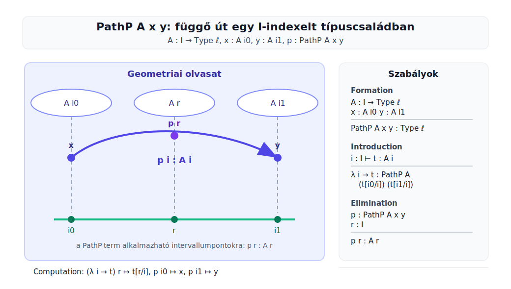
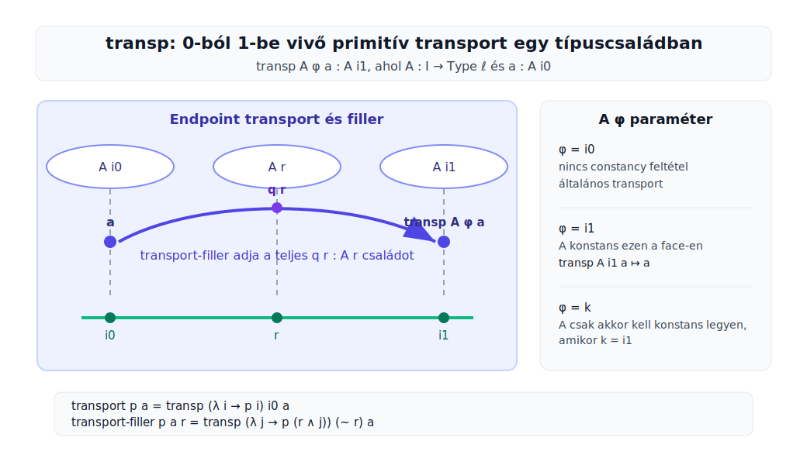

# Cubical Agda Guide

Ez a jegyzet a Cubical Agda path-, transport-, filler- és h-level mechanizmusainak minimális formális rétegzését rögzíti. A cél az, hogy egy konkrét bizonyításnál mindig azonosítható legyen:

```text
primitive/kernel szabály
BUILTIN név
library definíció
library lemma
HIT konstruktor
computation rule
geometriai vagy kategóriaelméleti intuíció
```

## 0. Státuszok

A jegyzet minden lényeges konstrukciónál megadja, milyen formális státuszú az adott állítás vagy kódrészlet.

Jelölések:

```text
[primitive/kernel]
  A typechecker vagy kernel része. Nem Agda-kódból következik.

[BUILTIN binding]
  Egy Agdában szereplő név hozzá van kötve egy kernel-jelentéshez.

[postulate-looking declaration]
  Olyan deklaráció, amely postulate formában jelenik meg, de BUILTIN miatt
  nem sima felhasználói posztulátumként kell olvasni.

[library definition]
  Agdában megírt definíció. Kibontással ellenőrizhető.

[library lemma]
  Agdában bizonyított segédtétel.

[HIT constructor]
  Egy magasabb induktív típus konstruktora, például path konstruktor.

[computation rule]
  Redukciós vagy judgemental egyenlőségi szabály.
  Ezek egy része nem olvasható ki pusztán a típusdeklarációból.

[intuition]
  Geometriai vagy kategóriaelméleti kép. Hasznos, de nem helyettesíti a szabályt.

[use in proof]
  Pontosan hol használjuk egy bizonyításban.
```

Sorrend:

```text
előbb a formális státusz,
utána az intuíció.
```

Minden konstrukciónál ezek a kérdések számítanak:

```text
milyen típusú termet ad?
melyik primitív vagy lemma adja?
milyen endpointjai vannak?
milyen computation rule vagy path bizonyítja ezt?
```

## 1. Technikai Útvonal

A dokumentum fő technikai lánca:

```text
PathP
  ↓
transp / transport / fill
  ↓
transport-filler
  ↓
toPathP
  ↓
isProp→PathP
  ↓
path-konstruktor esetek értelmes kezelése
```

Tipikus path-konstruktor eset:

```agda
f (path-constructor args i) =
  isProp→PathP
    (λ i -> P-isProp (path-constructor args i))
    (f left-endpoint)
    (f right-endpoint)
    i
```

A lánc összetevői:

```text
1. a path-konstruktor ad egy alaputat;
2. fölötte van egy típuscsalád, például B i;
3. a két végpontban már van bizonyítás;
4. transport/filler ad egy koherens liftet az egyik végpontból;
5. isProp igazítja a végpontot a kívánt másik bizonyításhoz;
6. toPathP ebből PathP-t készít.
```

## 2. PathP

A Cubical Agda primitive rétegében:

```agda
postulate
  PathP : ∀ {ℓ} (A : I → Set ℓ) → A i0 → A i1 → Set ℓ

{-# BUILTIN PATHP PathP #-}
```

A formális státusz:

```text
[postulate-looking declaration]
  A név deklarálva van Agda-szinten.

[BUILTIN binding]
  A BUILTIN pragma a PathP nevet a kernel függő path type formeréhez köti.

[primitive/kernel]
  A PathP-hez beépített typing és computation szabályok tartoznak.
```

<p align="center">
  
</p>

### Formation

```text
Γ ⊢ A : I → Type ℓ
Γ ⊢ x : A i0
Γ ⊢ y : A i1
────────────────────────────
Γ ⊢ PathP A x y : Type ℓ
```

Vagyis a `PathP` bemenetei:

```text
A       I-indexelt típuscsalád
x       kezdőpont az A i0 szálban
y       végpont az A i1 szálban
```

Az eredmény egy típus:

```agda
PathP A x y
```

### Introduction

```text
Γ, i : I ⊢ t : A i
────────────────────────────────────────────
Γ ⊢ λ i → t : PathP A (t[i0/i]) (t[i1/i])
```

Agda-szinten a path bevezetése ugyanazzal a szintaxissal történik, mint a függvényabsztrakció:

```agda
λ i → t
```

A végpontokat a term behelyettesített értékei adják:

```text
i = i0 esetén t[i0/i]
i = i1 esetén t[i1/i]
```

### Elimination / Application

```text
Γ ⊢ p : PathP A x y
Γ ⊢ r : I
────────────────────
Γ ⊢ p r : A r
```

Ezért ha:

```agda
p : PathP A x y
i : I
```

akkor:

```agda
p i : A i
```

Ez nem library lemma, hanem a `PathP` eliminációs/application szabálya.

### Computation

A lambda-path β-szabálya:

```text
(λ i → t) r  ↦  t[r/i]
```

A végponti számítási szabályok:

```text
p i0  ↦  x
p i1  ↦  y
```

Ezek judgemental endpoint-szabályok a primitív path struktúrához tartoznak.

### PathP És Függvénytípus

A `PathP` termjei függvényszerűen használhatók:

```agda
p r
```

de a `PathP` nem definíció szerint azonos ezzel a Π-típussal:

```text
(i : I) → A i
```

Az eltérés a rögzített végponti adat:

```agda
p : PathP A x y
```

nemcsak azt adja, hogy:

```text
p i : A i
```

hanem a végpontokat is rögzíti:

```text
p i0 = x
p i1 = y
```

## 3. `transp`

A Cubical Agda primitive rétegében:

```agda
primitive
  primTransp :
    ∀ {ℓ} (A : (i : I) → Set (ℓ i))
    (φ : I)
    (a : A i0)
    → A i1
```

A Cubical library ezt `transp` néven exportálja:

```agda
primTransp  ↦  transp
```

A formális státusz:

```text
[primitive/kernel]
  A transp primitív művelet.

[library export]
  A Cubical.Core.Primitives a primTransp nevet transp-re nevezi át.

[computation rule]
  A számítási viselkedés nem a típusdeklarációból következik.
```

<p align="center">
  
</p>

### Típusa

```agda
transp : ∀ {ℓ}
  (A : (i : I) → Type ℓ)
  (φ : I)
  (a : A i0)
  → A i1
```

A típus olvasata:

```text
A       I-indexelt típuscsalád
φ       face / extent paraméter
a       kezdőelem az A i0 szálban

transp A φ a : A i1
```

Tehát a `transp` önmagában egy céloldali elemet ad:

```agda
transp A φ a : A i1
```

Nem ad közvetlenül minden `r : I`-re elemet `A r`-ben. A teljes liftet később a `fill`, illetve library-szinten a `transport-filler` adja.

### A `φ` Paraméter

A `φ` paraméter azt jelöli, melyik face-en kell a transportnak konstans/identitás jellegűnek lennie.

A Cubical library megjegyzése szerint `transp A φ a` hívásakor Agda ellenőrzi, hogy `A` konstans `φ`-n:

```text
A being constant on φ means that A should be a constant function
whenever the constraint φ = i1 is satisfied.
```

Konkrét esetek:

```text
φ = i0
  A tetszőleges lehet.
  Ez az általános 0-ból 1-be transport.

φ = i1
  A-nak konstansnak kell lennie.
  Ekkor a transport számításilag identitás.

φ = k, ahol k dimenzióváltozó
  A-nak csak abban a face-ben kell konstansnak lennie,
  ahol k = i1.
```

### Computation Rule

A speciális számítási szabály:

```agda
transp A i1 a  ↦  a
```

Ez csak akkor típushelyes, mert `φ = i1` esetén Agda megköveteli, hogy `A` konstans legyen ezen a face-en. Így `A i0` és `A i1` ebben a helyzetben ugyanannak a típusnak számít.

Fontos különbség:

```agda
transp A i0 a
```

általában nem redukál `a`-ra. Ez az általános transport. Még konstans család esetén sincs minden formában definíciós regularitás; a library ezért bizonyít külön lemmákat, például:

```agda
transportRefl : (x : A) → transport refl x ≡ x
```

### Miért Kell Transport?

Egy változó típuscsaládnál általában nincs közvetlen azonosítás a két végponti szál között:

```agda
B i0 : Type
B i1 : Type
```

Egy elem:

```agda
b0 : B i0
```

nem használható közvetlenül `B i1`-beli elemként. Ez akkor sem csak technikai akadály, ha a két szál valamilyen úton össze van kötve: a termnek előbb át kell kerülnie a cél-szálba.

A `transport` ezt a lépést végzi el:

```agda
transport (λ i → B i) b0 : B i1
```

Tehát a minta:

```text
nem:       b0-t közvetlenül összehasonlítjuk b1-gyel

hanem:     b0-t átvisszük B i1-be
           ott hasonlítjuk össze b1-gyel
```

Formálisan:

```agda
b0 : B i0
b1 : B i1

transport (λ i → B i) b0 : B i1
```

Most már mindkét elem ugyanabban a típusban van:

```agda
transport (λ i → B i) b0 : B i1
b1                         : B i1
```

így értelmes az egyenlőség:

```agda
transport (λ i → B i) b0 ≡ b1
```

Ez a közvetlen végpont-azonosítás helyett a cél-szálbeli azonosítás. A `PathP B b0 b1` egyik standard olvasata pontosan ez:

```agda
transport (λ i → B i) b0 ≡ b1
```

Ezt a kapcsolatot a library `toPathP` és `fromPathP` lemmái adják.

### `transport`

A library-beli `transport` a `transp` speciális esete:

```agda
transport : {A B : Type ℓ} → A ≡ B → A → B
transport p a = transp (λ i → p i) i0 a
```

Itt:

```agda
p : A ≡ B
```

azaz:

```agda
p : PathP (λ _ → Type ℓ) A B
```

Ezért:

```agda
λ i → p i : I → Type ℓ
```

egy típusút `A`-ból `B`-be. A `transport p a` ennek mentén viszi át:

```text
a : A
transport p a : B
```

### `transport-filler`

A `transp` céloldali elemet ad. A teljes, szálakon átmenő liftet a libraryben ez a definíció adja:

```agda
transport-filler :
  ∀ {ℓ} {A B : Type ℓ} (p : A ≡ B) (x : A)
  → PathP (λ i → p i) x (transport p x)

transport-filler p x i =
  transp (λ j → p (i ∧ j)) (~ i) x
```

Ez már egy `PathP`, tehát minden `i : I`-re van értéke:

```agda
transport-filler p x i : p i
```

Pontosabban:

```agda
transport-filler p x
  : PathP (λ i → p i) x (transport p x)
```

Endpointok:

```text
i = i0:
  transp (λ j → p (i0 ∧ j)) (~ i0) x
  =
  transp (λ j → p i0) i1 x
  ↦ x

i = i1:
  transp (λ j → p (i1 ∧ j)) (~ i1) x
  =
  transp (λ j → p j) i0 x
  =
  transport p x
```

Tehát:

```text
transp             céloldali transportált elem
transport-filler   a teljes függő út a kezdőponttól a transportált végpontig
```

### Kapcsolat A `fill` / `comp` Művelettel

Coquand-Huber-Sattler cikkében a megfelelő geometriai művelet gyakran `fill` és `comp` alakban szerepel.

A `fill` olvasata:

```text
fill(A, φ, b, u) r : A r
```

vagyis a kitöltés minden `r : I` pontban ad elemet.

A `comp` olvasata:

```text
comp(A, φ, u) : A 1
```

vagyis a kompozíció csak a céloldali elemet adja.

A kompozíciós prezentációban a `b = 0` irányú fill származtatott művelet:

```text
fill(A, φ, u) r = comp(A_r, φ, u_r)
```

ahol:

```text
A_r i = A (i ∧ r)
u_r i = u (i ∧ r)
```

Ez ugyanaz a minta, mint a library `transport-filler` definíciójában:

```agda
transport-filler p x i =
  transp (λ j → p (i ∧ j)) (~ i) x
```

Az `i ∧ j` itt azt biztosítja, hogy az `i` szerinti köztes pontig nézzük a családot, és azon belül végzünk 0-ból 1-be transportot.

## 4. Fibrációs Intuíció

Ha:

```agda
B : I → Type
```

akkor gondolhatunk úgy `B i`-re, mint az `i` fölötti szálra:

```text
i0 -------- i -------- i1
 |          |          |
B i0      B i        B i1
```

Egy:

```agda
q : PathP B b0 b1
```

formálisan azt jelenti:

```agda
q i : B i
```

és:

```agda
q i0 = b0
q i1 = b1
```

Intuíció:

```text
q egy liftelt út a B fibrációban.
```

Itt a "koherens lakócsalád" nem költői kifejezés. Azt jelenti:

```text
nem külön-külön választunk minden i-re egy bᵢ : B i elemet,
hanem egyetlen I-paraméteres termünk van:

  i : I ⊢ q i : B i
```

Ez a cubical megfelelője annak az intuíciónak, hogy az út "folytonosan halad" a szálak között. Nem topológiai epsilon-delta folytonosságról beszélünk, hanem arról, hogy egyetlen intervallumváltozós term adja az egész családot.

## 5. Forrástérkép, Első Kör

Ezeket a helyeket fogjuk használni:

```text
Agda primitive réteg:
  Agda.Primitive.Cubical.agda

Cubical library primitive export:
  Cubical/Core/Primitives.agda

Alap path, transport és h-level lemmák:
  Cubical/Foundations/Prelude.agda

Coquand-Huber-Sattler:
  Canonicity and homotopy canonicity for cubical type theory
  különösen 28:7 és 28:9 a fill/comp szabályokhoz
```

Lokális fájlok ezen a gépen:

```text
/home/mozow/snap/code/249/.local/share/agda/2.8.0/lib/prim/Agda/Primitive/Cubical.agda
/home/mozow/agda-libs/cubical/Cubical/Core/Primitives.agda
/home/mozow/agda-libs/cubical/Cubical/Foundations/Prelude.agda
/home/mozow/Letöltések/coquand_cubical_2019.pdf
```

## 6. Következő Adag

A következő részben ezt írjuk meg részletesen:

```text
I, i0, i1, _∧_, _∨_, ~_
PathP formációs, bevezetési, eliminációs és végpontszabályai
miért függvényszerű, de miért nem sima függvénytípus
```

Utána jön:

```text
transp
transport
transport-filler
fill/comp
toPathP
isProp→PathP
```

A konkrét HIT path-konstruktor esetek ezt a technikai láncot használják.
