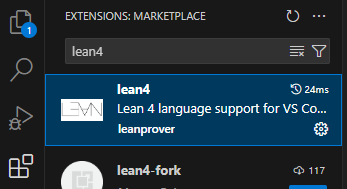
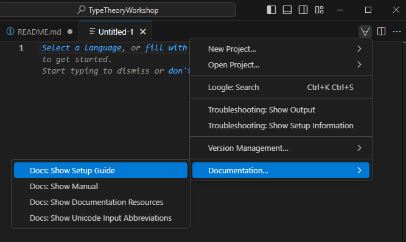
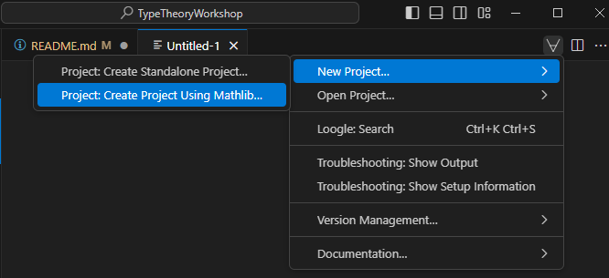

# Type Theory Workshop

## Lean 4 & Mathlib 4

Lean4: https://leanprover-community.github.io/learn.html

### Installing Lean 4
The following guide is based on the [official Lean documentation](https://lean-lang.org/lean4/doc/quickstart.html).

It is recommended to use Lean from inside VS Code for the most complete user experience, so the steps of the installation are
1. Install [VS Code](https://code.visualstudio.com/).

2. Launch VS Code and install the `lean4` extension by clicking on the "Extensions" sidebar entry and searching for "lean4". 

3. Open the Lean 4 setup guide by creating a new text file using "File > New Text File" (Ctrl+N), clicking on the ∀-symbol in the top right and selecting "Documentation… > Setup: Show Setup Guide". 

4. Follow the setup guide.


### Creating projects
Lean 4 is quite strict when it comes to projects. Unfortunately it is not possible to edit files interactively outside a project, or at least it takes significant effort. A project is much more than a folder with our files in it. It is a git repo in itself and more importantly it has a detailed description of the dependencies (i.e. the version of Lean 4 and mathlib), so these will be downloaded and installed automatically. This enables the simultaneous usage of several Lean 4 and mathlib versions across projects. But this also means that the projects contain most of these dependencies locally in hidden folders. Due to vastness of the knowledge contained in mathlib this result in project folders exceeding several gigabytes.

So we clarified we need a project in order to work, the next natural step is to creat one. For that we have several options. First we could create it from within the VS Code GUI by clicking on the ∀-symbol in the top right and selecting "New Project… > Project: Create Project Using Mathlib…" 

This will download and install Mathlib which might take a few minutes.

For the technologically inclined there is a completely [command line based method for setting up projects](https://leanprover-community.github.io/install/project.html). A summary of that follows below.

````my_project```` is going to be your Lean4 project (within a folder say Dokumentumok/Lean, where you are in, in Terminal or "Parancssor" for win)  

````terminal
lake +leanprover/lean4:nightly-2024-04-24 new my_project math
````

Then ````my_project/my_project```` and ````my_project/my_project/Basic.lean```` are created, and within it, you can start programming in Lean4.  

If you use VS Code, then **open** the project as a **folder** (my_project) and you have to activate the **Lean4 language extension,** then probably **restart** VS Code for a several times :D

## Theorem Proving in Lean4

For a quick introduction see https://leanprover.github.io/theorem_proving_in_lean4/title_page.html .

To check that Mathlib4 works well in your Lean4 project, we create a theorem in Basic.lean (clearly, you can create new .lean files in this folder).

````lean
theorem flipterms : forall A B : Prop, A ∧ B → B ∧ A
````
the standard **surface form** is

````theorem name_of_the_theorem : proposition_of_the_theorem := proof_term````, 

however deep in it **the meaning is:**

````definition name_of_the_inhabitant : type_of_the_inhabitant_where_it_lives := the_inhabitant````

Here ````the_inhabitant```` is a term or program in Lean4's native **functional** language.

You start the so called proof mode by "by", and you jump into the **imperative** language of tactics, that generates the proof terms in a semi-automated way. In the proof mode there are premisses and the goal in the following form: 

$$\dfrac{\begin{matrix}
\text{Premiss }1\\ 
\text{Premiss }2  \\  
\vdots \\
\text{Premiss }n
\end{matrix}}{\vdash \text{Goal}}$$

Here $\vdash$ is the provability or typeability sign, and it is called "turnstyle". If the theorem is in the form "forall A, if B then C", then you can put the conditions A and B into the premmisses by the tactic **"intros".** If you name the contitions then they are going to get names: "intros A B" gives names to them. 

$$
\vdash \forall \text{ } A \text{ } B \text{ } C\text{ : Prop}, B \to C\quad
\underset{\text{intros A B C h}}{\to} \quad
\dfrac{\begin{matrix}
A\text{ : Prop}\\ 
B\text{ : Prop}\\  
C\text{ : Prop}\\
h\text{ : B}\\
\end{matrix}}
{\vdash C}$$

Tactic **"apply?"** searches for a logical inference rule or a lemma in **Mathlib4** which potencially can prove the goal.

## Using Mathlib4

The main help that Mathlib gives us is the Mathlib tactic apply? and rw?. The former searches for lemmas with the same conclusion pattern that the goal has, the latter searches equation to rewrite the goal in an identical form.

A bit problematic one to search for lemmas by ourselves. However the documentation of Mathlib helps us: https://leanprover-community.github.io/mathlib4_docs/   


