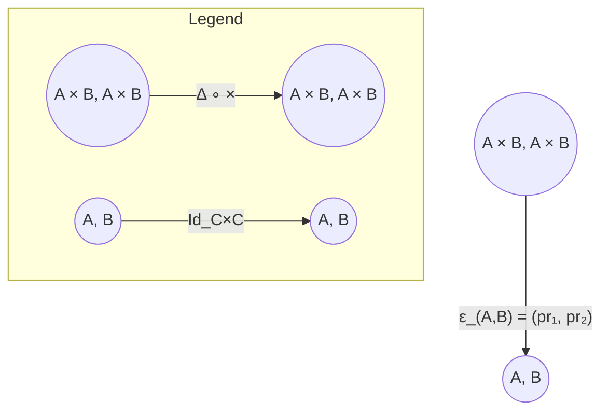

```mermaid
graph TD
    P_pair((A × B, A × B)) -- "ε_(A,B) = (pr₁, pr₂)" --> AB_pair((A, B))

    subgraph Legend
        direction LR
        P_pair_start((A × B, A × B)) -- "Δ ∘ ×" --> P_pair_end((A × B, A × B))
        AB_pair_start((A, B)) -- "Id_C×C" --> AB_pair_end((A, B))
    end
```
